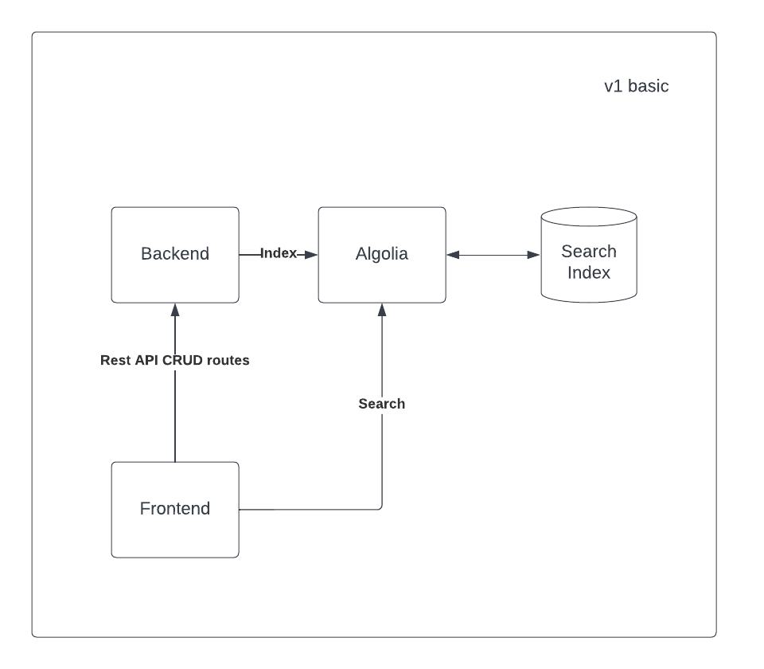

# Moviola

## Summary

Moviola is a central hub for movie fanatics, allowing users to search for films based on certain facets. Users can also take ownership of the database and update/remove films as needed.

The application is a set of micro-services including a front-end SPA and a back-end server, both with the ability to interact with our search platform of choice.

## Get Started

### Prerequisites

1. Create an Algolia Application and an Algolia Index

#### Environment

We have shared `./.env.example` file at the root with environment variables that
will be shared between the _frontend_ and _backend_ applications.

There is also a `./apps/backend/.env.example` file with sensitive environment variables specific to the backend application. We don't want to expose these to the frontend.

You can create a `./apps/frontend/.env.test` file with specific environment variables for testing in case we want to use different credentials.

1. Copy each `.env.example` and rename it to `.env`
2. Set the environment variables `NEXT_PUBLIC_ALGOLIA_APP_ID`, `NEXT_PUBLIC_ALGOLIA_ADMIN_API_KEY`, `NEXT_PUBLIC_ALGOLIA_PUBLIC_API_KEY` and `NEXT_PUBLIC_ALGOLIA_INDEX_NAME` in the .env file. You can obtain those from the Algolia Dashboard.

### Local Development

To run this project we will need to:

1. `yarn` to install dependencies
2. `yarn start` to run our dev servers
3. Open a browser and navigate to `http://localhost:4200`. The app will automatically reload if you change any of the source files.
4. The backend can be accessed at `http://localhost:3333/api` or proxied through the frontend with this endpoint: `http://localhost:4200/api`.

### Production Build

There are few scripts set up depending on what you are trying to build.

| script             | env        | apps              |
| ------------------ | ---------- | ----------------- |
| yarn build:prod    | production | backend, frontend |
| yarn build:be:prod | production | backend           |
| yarn build:fe:prod | production | frontend          |

### Run production build locally

Here is how we can run these builds locally.

**\*Note** that the `frontend` defaults to port `3000` with a production build.

| script             | env        | apps              |
| ------------------ | ---------- | ----------------- |
| yarn start:prod    | production | backend, frontend |
| yarn start:be:prod | production | backend           |
| yarn start:fe:prod | production | frontend          |

## Deployment Pipeline

Currently we have the project setup to deploy on the backend to Google Cloud Run through their continous deployment trigger, connected to github. The frontend is using Vercel for simplicity.

### Frontend

- Setup [Vercel](hhttps://nextjs.org/docs)
- Setup [deploy hooks](hhttps://vercel.com/docs/concepts/git/deploy-hooks)
  - Build command
    - `npx nx build frontend --prod`
  - Output Directory
    - `dist/apps/frontend/.next`
  - Include Filter
    - add `libs/**` & `apps/frontend/**`
  - Ignore Build Step
    - `git diff HEAD^ HEAD --quiet ./apps/frontend/`
  - Add environment variables
  ```sh
    NEXT_PUBLINEXT_PUBLIC_ALGOLIA_APP_ID
    NEXT_PUBLINEXT_PUBLIC_ALGOLIA_PUBLIC_API_KEY
    NEXT_PUBLINEXT_PUBLIC_ALGOLIA_INDEX_NAME
    NEXT_PUBLINEXT_PUBLIC_URL # should point to backend
  ```

### Backend

- Setup (Cloud Run)[https://cloud.google.com/run] service `moviola-backend`
- Setup [continuous deployment](https://cloud.google.com/run/docs/continuous-deployment-with-cloud-build)
  - Configure to build from **Docker**
  - Dockerfile should point to `Dockerfile.backend`
  - Include Filter
    - add `libs/**` & `apps/backend/**`
  - Edit Image name: `gcr.io/moviola-358701/github.com/cbodtorf/moviola-backend:$COMMIT_SHA`
  - Add environment variables
  ```sh
    NNEXT_PUBLIC_ALGOLIA_APP_ID
    NNEXT_PUBLIC_ALGOLIA_ADMIN_API_KEY
    NNEXT_PUBLIC_ALGOLIA_INDEX_NAME
    FRONTEND_HOST # should point to frontend hostname
  ```

### Notes

- When creating new services, we may need to update the `edit & deploy new revision`.

  - The **placeholder** image is used by default, but once our images are build from the pipeline, we can connect them up by following these [instructions](https://cloud.google.com/run/docs/deploying#revision).
  - Just select the latest respective image for `Container image URL`

- The docker-compose.yml is just for testing individual builds before pushing.
  - `docker-compose up -d --build`
    - builds service (I like to comment out the unneeded service in the compose filee)
  - `docker ps`
    - to list images
  - `docker logs ${CONTAINER_ID}`
    - to show logs
  - `docker kill ${CONTAINER_ID}`
    - helpful if an image is not working as expected
  - `docker system prune --all`
    - helpful if docker runs out of space

## Design

A basic architecture diagram


### Backend API (v1)

- POST `/api/v1/movies` - adds movie to index

- PUT `/api/v1/movies/:id` - updates movie in index

- DELETE `/api/v1/movies/:id` - removes movie from index

## Action Items

#### Setup

- [x] Project Planning
- [x] Basic Architecture Diagram
- [x] Scaffold Monorepo
- [x] Readme
- [x] Update Next.js app to fit our needs
  - [x] Remove unneeded demo oriented code (rename to frontend)
- [x] Set up new Node app for backend
  - [x] Set up proxy for frontend app
- [x] Set up Algolia account for app
  - [x] Index seed data

#### v1 Feature Work

- [x] Backend
  - [x] Algolia Provider
  - [x] Routes
    - [x] POST - add movie to index
      - [x] Create route
      - [x] Connect to Algolia
    - [x] PUT - update movie in index
      - [x] Create route
      - [x] Connect to Algolia
    - [x] DELETE - removes movie from index
      - [x] Create route
    - [x] Connect to Algolia
  - [ ] Use :uuid for PUT/DELETE url param
  - [ ] Update response to be uuid
- [x] Frontend
  - [x] Search Page
    - [x] Search Component
      - [x] Styling
      - [x] Logic/Hooks
      - [x] Powered by Algolia
    - [x] Results Component
      - [x] Styling
      - [x] Logic/Hooks
    - [x] Result Component
      - [ ] Add highlights
      - [x] Styling
      - [x] Logic/Hooks
      - [x] Delete action
    - [x] Form Component
      - [x] Styling
      - [x] Logic/Hooks
      - [x] Improve basic validation
  - [x] Cleanup
    - [x] Remove Action Pages that were for testing
    - [x] Remove Unused imports
    - [x] Linting/Formatting
    - [x] Remove landing page (make `/search` the route)
    - [x] Remove scaffolding styles

#### Production Readiness

- [x] Deployment Pipeline
- [x] Versioning
- [x] Healthcheck
- [x] Error catching and proper shutdown
- [x] Dedicated logger

#### Developer Experience

- [ ] Github files
- [x] Precomit/Prepush hooks
  - [x] Formatting
  - [x] Linting
  - [x] Testing

#### v2 Feature Work

- [x] Devops
  - [x] Containerize
- [ ] Backend
  - [ ] Users
  - [ ] Authenticated Routes
  - [ ] Add traditional DB before indexing to Algolia
- [ ] Frontend
  - [ ] Skeleton Component Loading States
  - [ ] Login Page
  - [ ] Account Page
  - [ ] SEO
  - [ ] Analytics

## History

- This NX command was run to scaffold the project:

```sh
npx create-nx-workspace moviola \
  --appName=frontend \
  --preset=next \
  --style=scss \
  --nx-cloud
```

- This NX command was used to scaffold the backend project that configures a proxy to our frontend project:

```sh
yarn nx generate @nrwl/express:application backend --frontendProject frontend
```

- Express was removed in favor of Fastify

* For our libs we used this command to scaffold logger and schema:

```sh
yarn nx generate @nrwl/js:lib logger
```

```sh
yarn nx generate @nrwl/js:lib schema
```
